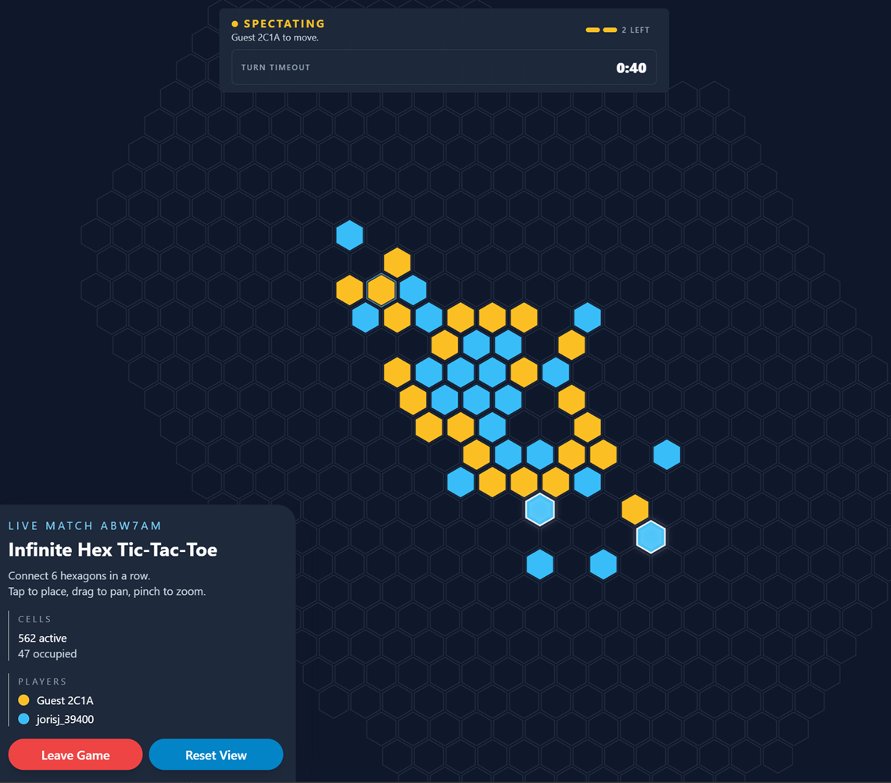

# Infinity Hexagonal Tic-Tac-Toe

Small monorepo for a real-time 2-player abstract strategy game inspired by the following YouTube video from webgoatguy:
https://www.youtube.com/watch?v=Ob6QINTMIOA

Official website:
https://hex-tic-tac-toe.did.science/

## Game

Infinity Hexagonal Tic-Tac-Toe is played on an infinite hexagonal grid with an asymmetric opening:

- Player 1 starts the game with a single move on any empty hex.
- Player 2 replies with two consecutive moves.
- Every turn after that also contains two moves.
- The board is infinite, so the game can expand in any direction.
- The first player to connect six of their own hexagons in a straight line on one axis wins.

## Preview
[](https://hex-tic-tac-toe.did.science/)

## Software Stack
- pnpm & TypeScript
- Node.js + Express + Socket.io + MongoDB
- React + Zustand + React-Router

## Development

### Local development

Install dependencies and start the frontend and backend in separate terminals:

```bash
pnpm install
pnpm dev:backend
pnpm dev:frontend
```

Frontend: `http://localhost:5173`  
Backend: `http://localhost:3001`

Create `packages/backend/.env` before starting the backend. The backend requires:

- `MONGODB_URI`
- `AUTH_SECRET`
- `AUTH_DISCORD_ID` or `DISCORD_CLIENT_ID`
- `AUTH_DISCORD_SECRET` or `DISCORD_CLIENT_SECRET`

Common local values in `packages/backend/.env` look like this:

```dotenv
PORT=3001
MONGODB_URI=mongodb://localhost:27017
MONGODB_DB_NAME=ih3t
AUTH_SECRET=replace-me
DISCORD_CLIENT_ID=replace-me
DISCORD_CLIENT_SECRET=replace-me
```

Optional backend environment variables:

- `ALLOWED_ORIGINS`
- `FRONTEND_DIST_PATH`
- `LOG_LEVEL`
- `LOG_PRETTY`
- `REMATCH_TTL_MS`
- `MONGODB_METRICS_COLLECTION`
- `MONGODB_GAME_HISTORY_COLLECTION`
- `MONGODB_AUTH_USERS_COLLECTION`
- `MONGODB_AUTH_ACCOUNTS_COLLECTION`
- `MONGODB_AUTH_SESSIONS_COLLECTION`
- `MONGODB_AUTH_VERIFICATION_TOKENS_COLLECTION`

Discord OAuth must be configured with the backend callback URL:

```text
http://localhost:3001/auth/callback/discord
```

In production, use your deployed backend origin for the same `/auth/callback/discord` path.

Server logs are printed to the console and also written to `logs/server.log`, rotating in 50 MB segments with a 500 MB total cap.

While the backend is running, type `shutdown` into the backend terminal and press Enter to schedule a graceful shutdown.
This immediately blocks new games, gives existing sessions up to 10 minutes to finish, and then closes any remaining sessions before the server exits.
Sending `SIGINT` or `SIGTERM` follows the same graceful path on the first and second signal; the process exits immediately only after the third signal.

## Docker Deployment

The included multi-stage `Dockerfile` builds the frontend, builds the backend, and serves the compiled frontend through the backend on port `3001`.

Build the image:

```bash
pnpm docker:build
```

Run it with your backend environment file:

```bash
docker run --rm \
  -p 3001:3001 \
  --env-file packages/backend/.env \
  --name ih3t \
  ih3t:latest
```

The container exposes only port `3001`. In production, the frontend is served by the backend from the same origin, so users only need to reach the backend URL.

For a long-running deployment, remove `--rm`, run the container detached, and consider mounting a volume for persistent logs:

```bash
docker run -d \
  -p 3001:3001 \
  --env-file packages/backend/.env \
  -v ih3t-logs:/app/logs \
  --name ih3t \
  ih3t:latest
```

The Docker build context excludes `.env` files, so runtime configuration must be provided with `--env-file` or `-e` flags when the container starts.

## AI Use

> This project was built mostly with AI-assisted "vibe coding" techniques.

Why?  
I wanted to experiment with AI coding systems, especially GPT-based ones, and this project felt like a good fit. I already have a strong background in web development and in this tech stack, but using AI to build the initial prototype helped speed things up considerably.

#### Contributing note on AI
AI-assisted pull requests are welcome, but responsibility for the final change always stays with the author of the PR. If you use AI, **you are still expected to understand every change**, **test them** properly, and **make any necessary adjustments** before requesting review.
